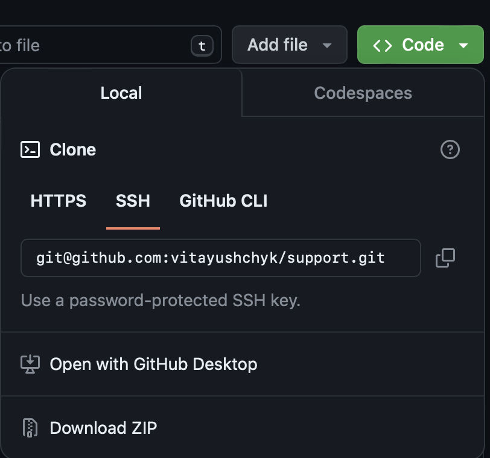

# Support

This is my graduation project, which I did while studying at the Hillel IT School.

## Installation:

### Clone this repository using GitHub Desktop:


## Preparations:

### .env:

Please, make sure that you have a .env in the root folder. Feel free to specify values of environmental variables as you wish, but make sure that your .env file structured like .env.example.


## Start develop with Docker:

Firstly, you need to have Docker installed in your system. If you haven't installed Docker yet, visit https://docs.docker.com/get-docker/ .

### Commands:

- Run and build application:
```
    make build_and_run
 ```
- Run application:
```
    make build_and_run
```
  
- Drop all containers:
```
    make drop_all_containers    
```
- Create super user:
```
    make_super_user 
 ```
- Show logs:
```
    docker logs api
    docker logs db
```
## DB migrotion:
- Make migrations of the DB:
```
    make make_migrate
```  
- Migrate the DB:
```
    make run_migrate  
```
The pipenv is used as a main package manager on the project. For more information please follow the 🔗 [documentation](https://pipenv.pypa.io/en/latest/)

 - Creating a new virtual environment
```  
pipenv shell
```  
- Creating a .lock file from Pipenv file
```  
pipenv lock
```  

- Installing dependencies from .lock file
```  
pipenv sync
```  